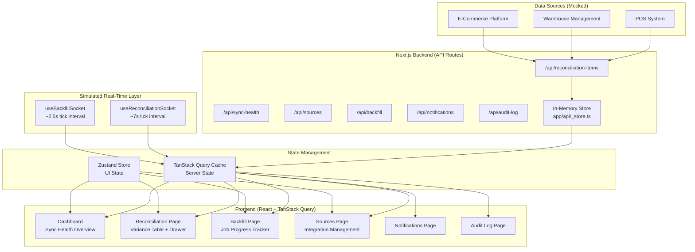
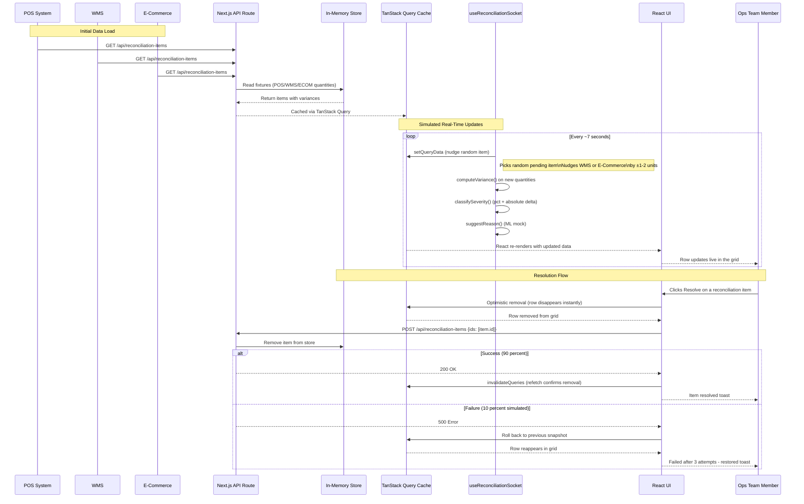
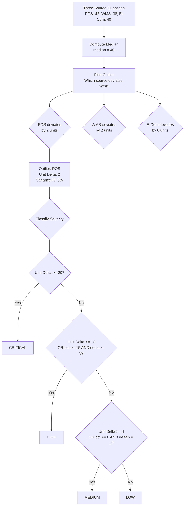
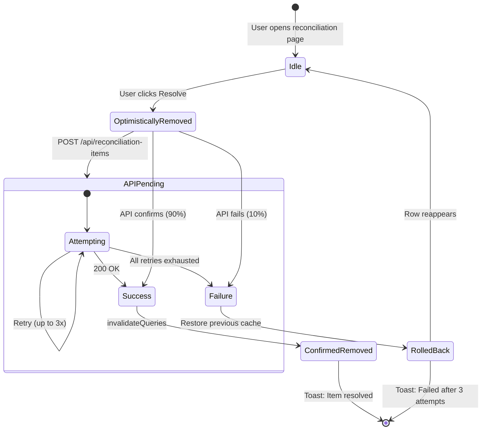
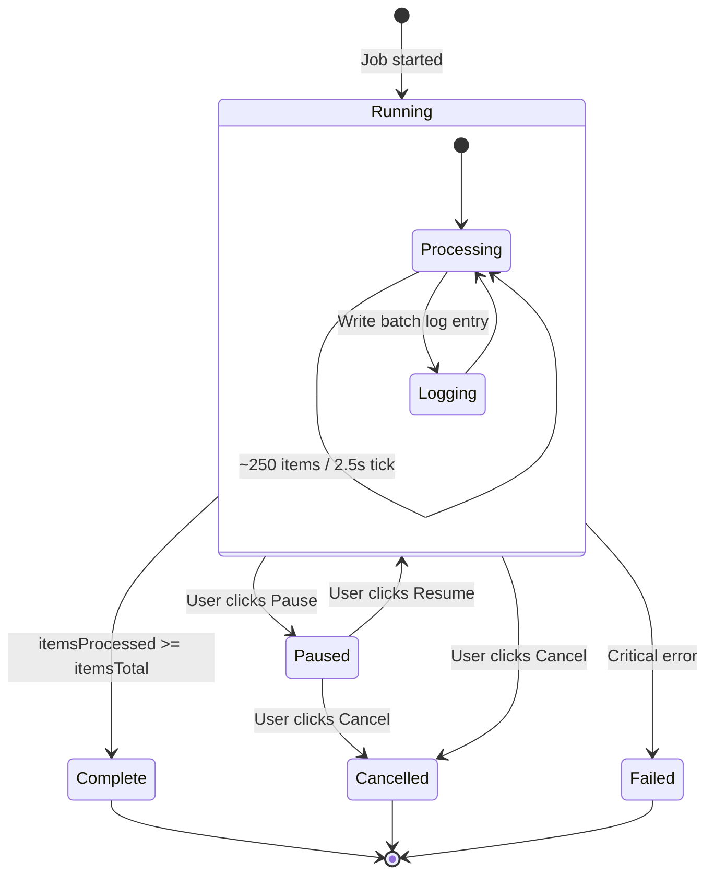
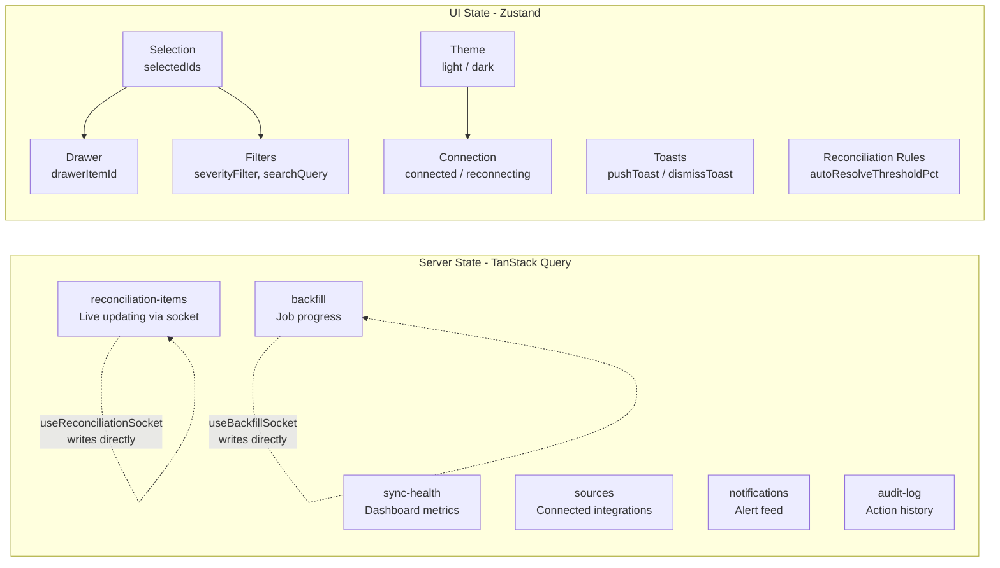
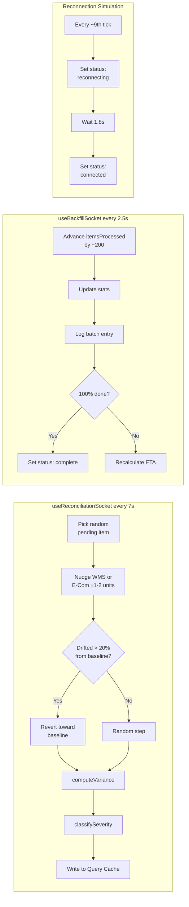
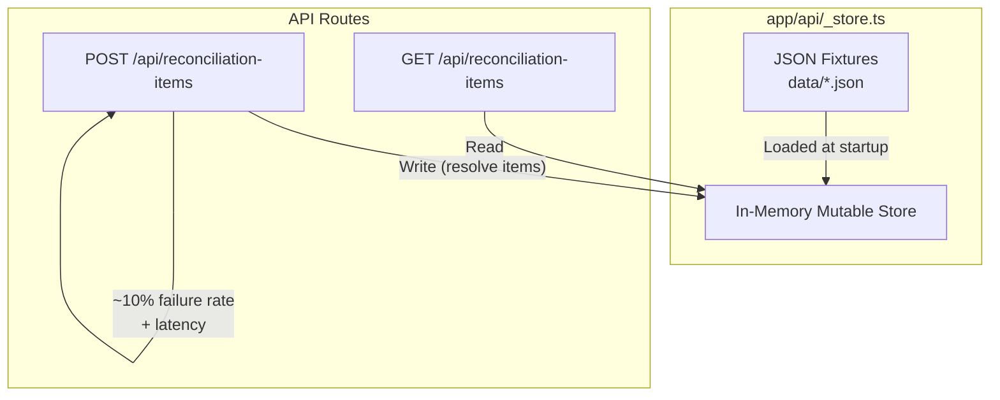
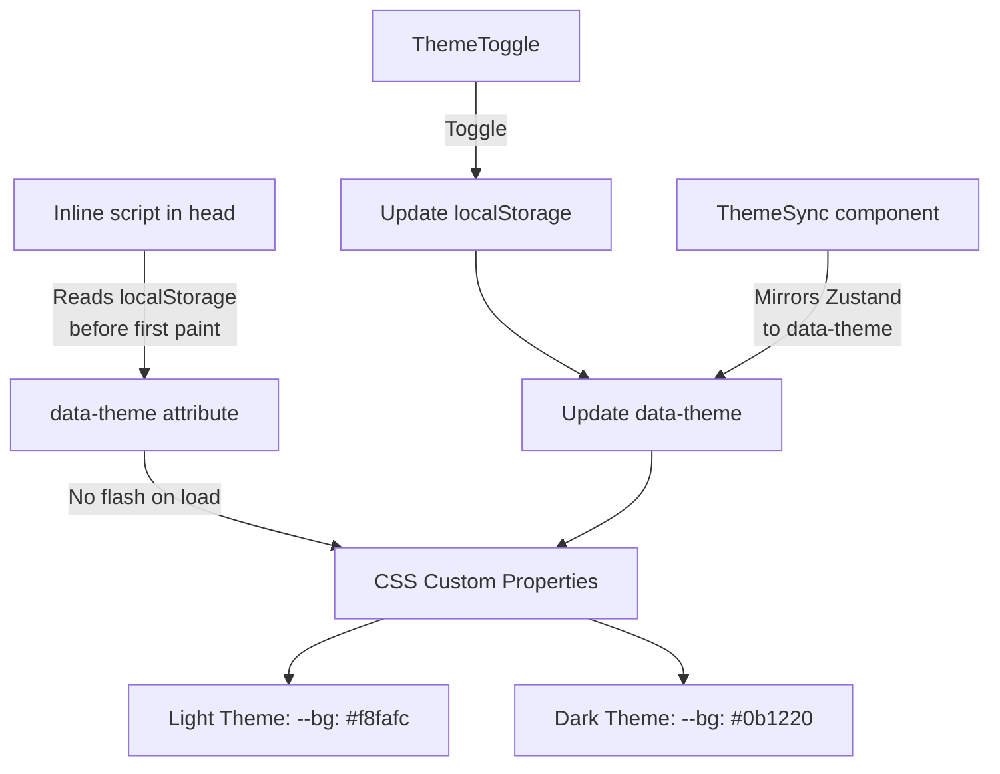

# StockSync — Swati Keshari

Personal frontend workbench: compare shop, warehouse, and website stock lists. Built with **Next.js**, **React**, **TypeScript**, **TanStack Query**, **Zustand**, **AG Grid**, **ECharts**, and **Tailwind CSS**.

> Mock data only. No real shop, database, or password store. Log in with the demo credentials printed on `/login`.

Start at `/` (story) then `/learn` (class 10 English) then `/workbench` (the tool).

---

## Why This Project Was Built

### The Problem in the Real World

Retail and e-commerce businesses operate across **multiple inventory systems simultaneously**:

```
┌──────────┐   ┌──────────┐   ┌──────────────┐
│   POS    │   │   WMS    │   │ E-Commerce   │
│ (Cash    │   │ (Ware-   │   │ (Shopify,    │
│ Registers)│  │  house)  │   │  Amazon, etc)│
└────┬─────┘   └────┬─────┘   └──────┬───────┘
     │              │                 │
     └──────────────┼─────────────────┘
                    │
           ┌────────▼────────┐
           │  ?? Discrepancy │
           │     Nobody      │
           │      Knows      │
           └─────────────────┘
```

**Each system tracks inventory independently.** The POS says 42 units of SKU-1024 are on the shelf. The warehouse management system (WMS) says 38. The e-commerce platform says 40. **Which number is right?** Nobody knows — and until someone figures it out, the business faces:

1. **Stockout risk** — A product shows "in stock" online but the shelf is empty, leading to failed fulfillments, angry customers, and lost revenue.
2. **Shrinkage (theft/damage)** — Physical inventory is lower than any system reports, silently eating into margins.
3. **Overstocking** — Systems over-report availability, triggering unnecessary reorders that tie up capital in dead inventory.
4. **Manual reconciliation hell** — Ops teams export CSVs from 3 systems, paste them into Excel, VLOOKUP by SKU, and manually compare quantities row by row. This takes hours, is error-prone, and only captures a snapshot — not the real-time drift happening right now.
5. **No audit trail** — When discrepancies are found, there's no record of who resolved them, which source was accepted as truth, or why.

### What This Project Solves

StockSync is a **real-time inventory reconciliation dashboard** that solves all of the above:

- **Automatically detects** quantity discrepancies across POS, WMS, and E-Commerce sources
- **Classifies severity** using both percentage variance AND absolute unit delta (a 2-unit swing on 4 units is noise; the same 2 units on 400 units is real shrinkage)
- **Suggests root causes** via ML classification (timing lag, data entry error, possible shrinkage)
- **Prioritizes by dollar impact** — not raw percentage — so ops teams triage what actually costs the most
- **Provides real-time updates** — every ~7 seconds, simulated sync ticks update the reconciliation queue live
- **Supports bulk actions** — resolve multiple items at once
- **Maintains a full audit trail** — every action is logged with actor, timestamp, and outcome
- **Tracks shrinkage exposure** — dollar-value estimate of total inventory discrepancy

---

## How It Works — Full Application Flow

### Architecture Overview



### Data Flow — From Sync to Resolution



### Reconciliation Logic — Severity Classification

The system uses a **dual-factor severity model** that considers both percentage variance AND absolute unit difference:



**Why dual-factor?** A 50% variance on a 4-unit SKU is just 2 units — likely noise. A 5% variance on a 1,000-unit SKU is 50 units — potentially real shrinkage worth hundreds of dollars.

### Optimistic Resolution Flow

When an ops team member resolves an item, the UI uses **optimistic updates** for instant feedback:



### Backfill Job Lifecycle

The backfill system simulates importing historical inventory data from an external system:



### State Management Architecture



---

## Pages & Features

| Route | Page | Description |
|---|---|---|
| `/` | **Sync Health Dashboard** | Live overview of all connected sources, data quality score, sync activity chart, pending variance summary, and dollar exposure estimate |
| `/reconciliation` | **Reconciliation Table** | Full AG Grid table of all pending variances, sorted by dollar impact. Includes search, severity filters, detail drawer with per-source quantities, ML-suggested reason, assignment, notes, and bulk actions |
| `/backfill` | **Backfill Tracker** | Real-time progress of historical data import — progress bar, stats (records updated, variances found, errors), ETA, activity log, and pause/cancel/retry controls |
| `/sources` | **Source Management** | Configure POS, WMS, and E-Commerce integrations — API keys (masked/reveal/copy/rotate), webhook URLs, sync frequency, rate limits, scopes, and a configurable reconciliation policy panel |
| `/notifications` | **Notifications** | Alert feed with severity-colored icons, deep-links into specific reconciliation items, and mark-as-read |
| `/audit-log` | **Audit Trail** | Searchable log of every action (resolve, bulk action, manual count, source config change) with actor, timestamp, SKU, and outcome |
| `/profile` | **Profile & Settings** | User profile, theme preference (light/dark), and account actions |
| `/login`, `/signup`, `/forgot-password` | **Auth Screens** | Demo auth UI — login checks against a fake credential, shows inline errors |

---

## Architecture Deep Dive

### Simulated Real-Time Layer

Since there's no real WebSocket server, the app uses **`setInterval` hooks** that write directly into the TanStack Query cache — exactly how a real WebSocket `onmessage` handler would:



**Key design choices:**
- **Mean-reverting drift** — quantities nudge back toward baseline after drifting >20%, preventing unrealistic 175%+ variance percentages
- **Baseline captured lazily** — the first time an item is touched, not eagerly at mount (which would always be `undefined` since queries are async)
- **One severity formula** — `lib/severity.ts` is the single source of truth, used by both fixture data and live simulation

### Mock Backend with Mutable State



The `_store.ts` module keeps a **mutable in-memory copy** of the fixture data so that resolving an item actually persists across refetches — unlike a pure stateless route that would just re-read the static JSON.

### Theme System



---

## Tech Stack

| Layer | Technology | Purpose |
|---|---|---|
| **Framework** | Next.js 16 (App Router) | File-based routing, API routes, SSR |
| **UI Library** | React 19 | Component rendering, hooks |
| **Language** | TypeScript (strict mode) | Type safety across the entire stack |
| **Server Cache** | TanStack Query v5 | Query caching, optimistic updates, mutations, retries |
| **Client State** | Zustand | Selection, drawer, filters, theme, toasts, connection status |
| **Data Grid** | AG Grid Community 35 | Reconciliation table with sorting, selection, and custom renderers |
| **Charts** | ECharts + echarts-for-react | Sync activity time-series chart |
| **Styling** | Tailwind CSS 3.4 | Utility-first CSS with CSS custom property design tokens |
| **Icons** | lucide-react | Inline SVG icons (no icon font) |
| **Fonts** | Inter (sans) + JetBrains Mono (mono) | Loaded via `next/font/google` |

---

## Project Structure

```
stocksync-workbench/
├── app/
│   ├── (auth)/              # Auth pages (login, signup, forgot-password)
│   ├── (dashboard)/         # Main app pages
│   │   ├── page.tsx         # Dashboard — sync health overview
│   │   ├── reconciliation/  # Variance table + detail drawer
│   │   ├── backfill/        # Backfill job progress tracker
│   │   ├── sources/         # Source configuration & management
│   │   ├── notifications/   # Notification feed
│   │   ├── audit-log/       # Audit trail
│   │   └── profile/         # User profile & settings
│   ├── api/                 # Next.js API routes (mock backend)
│   │   ├── _store.ts        # In-memory mutable state
│   │   ├── reconciliation-items/
│   │   ├── sync-health/
│   │   ├── sources/
│   │   ├── backfill/
│   │   ├── notifications/
│   │   └── audit-log/
│   ├── layout.tsx           # Root layout with theme init script
│   ├── providers.tsx        # QueryClientProvider + React Query devtools
│   └── globals.css          # Design tokens (light/dark), AG Grid theme
├── components/
│   ├── backfill/            # ProgressTracker
│   ├── dashboard/           # StatusCard, SyncActivityChart, PendingSummary, ExposureCard
│   ├── reconciliation/      # ReconciliationGrid, DetailDrawer, BulkActionModal
│   ├── shared/              # Header, Footer, ThemeToggle, ThemeSync, StatusPill, HealthBar, etc.
│   └── sources/             # SourceConfigModal, ReconciliationRulesPanel
├── data/                    # JSON fixtures (mock data)
├── hooks/
│   ├── useReconciliationSocket.ts   # Simulated real-time variance updates
│   ├── useBackfillSocket.ts         # Simulated backfill progress
│   ├── useOptimisticResolve.ts      # Optimistic remove-on-resolve + rollback
│   ├── useReconciliationItems.ts    # TanStack Query hook
│   ├── useSyncHealth.ts
│   ├── useSources.ts
│   ├── useNotifications.ts
│   ├── useAuditLog.ts
│   └── useBackfill.ts
├── lib/
│   ├── api.ts               # API client (fetch wrappers)
│   ├── types.ts             # TypeScript interfaces
│   ├── severity.ts          # Variance computation & severity classification
│   └── queryClient.ts       # TanStack Query client config
├── stores/
│   └── useUiStore.ts        # Zustand store for all UI state
├── scripts/
│   └── recompute-fixtures.js  # Recompute fixture data through severity logic
├── .npmrc                   # legacy-peer-deps for Vercel builds
├── tailwind.config.ts
├── next.config.mjs
└── package.json
```

---

## Getting Started

```bash
# Install dependencies
npm install

# Start development server
npm run dev
```

Open [http://localhost:3000](http://localhost:3000).

> **Demo credentials:** The login page shows the accepted email/password. Any other credentials show an inline error.

---

## Design System

### Color Tokens

| Token | Light | Dark | Usage |
|---|---|---|---|
| `--bg` | `#f8fafc` | `#0b1220` | Page background |
| `--surface` | `#ffffff` | `#131b2e` | Card/panel background |
| `--surface-alt` | `#f1f5f9` | `#0f172a` | Alternate surface (hover, active) |
| `--border` | `#e2e8f0` | `#27324a` | Borders |
| `--text-primary` | `#0f172a` | `#f1f5f9` | Primary text |
| `--text-secondary` | `#64748b` | `#94a3b8` | Secondary/muted text |
| `--primary` | `#3b82f6` | `#3b82f6` | Primary action color |
| `--status-low` | `#10b981` | `#10b981` | Low severity (green) |
| `--status-medium` | `#f59e0b` | `#f59e0b` | Medium severity (amber) |
| `--status-high` | `#f97316` | `#f97316` | High severity (orange) |
| `--status-critical` | `#ef4444` | `#ef4444` | Critical severity (red) |

### Accessibility

- **Keyboard navigation** — visible focus indicators using `box-shadow` (hugs element shape, unlike `outline` which fights `border-radius`)
- **Reduced motion** — all animations disabled via `prefers-reduced-motion: reduce`
- **Screen reader labels** — icon buttons include `aria-label`, toggle buttons include `aria-pressed`
- **Color contrast** — all text meets WCAG AA against its background in both themes

---

## Production-Readiness Audit

This build went through a detailed production-readiness review. Key bugs found and fixed:

| Issue | Root Cause | Fix |
|---|---|---|
| Resolved items reappeared after refetch | Stateless mock API re-read static JSON | Added in-memory mutable store (`_store.ts`) with POST endpoint |
| Duplicate checkbox columns in AG Grid | Legacy `checkboxSelection` mixed with new `rowSelection` API | Removed legacy colDef, use `rowSelection` object API only |
| Selecting a row also opened its drawer | `onRowClicked` didn't distinguish checkbox from row click | Separated selection and drawer-open handlers |
| Drawer state leaked between items | Local state not keyed to item id | Added `key={item.id}` to force remount on item switch |
| Resolve button showed wrong retry state | Shared mutation instance's `variables` not checked | Added `resolve.variables === item.id` guard |
| Selection bar count went stale | `clearSelection()` only cleared Zustand, not AG Grid | Added `api.deselectAll()` call |
| Mean-reversion never fired | Baseline captured eagerly at mount (always `undefined`) | Captured lazily on first touch per item |
| Theme flashed on load | Default theme only corrected by React effect | Added render-blocking inline script in `<head>` |
| Backfill progress bar frozen | No socket simulation for backfill page | Added `useBackfillSocket` hook |
| Copy buttons never copied | Showed "copied" toast without calling clipboard API | Added `navigator.clipboard.writeText()` |
| Profile dropdown stuck on mobile | Only closed via `onMouseLeave` (no touch events) | Added `pointerdown-outside` listener |

---

## What's Out of Scope (By Design)

Per the project spec, these features are **intentionally mocked** rather than implemented:

- **ML variance classification** — The `suggestedReason` and `confidence` fields are pre-baked into fixture data. In production, this would call an isolation-forest anomaly detector.
- **Real WebSocket server** — Simulated via `setInterval` + TanStack Query cache writes.
- **Kafka/PostgreSQL backend** — The in-memory store stands in for what would be a real database with event sourcing.

These mock boundaries are clearly documented in the code so a production team could swap them for real implementations without changing the frontend.

---

## License

Built as a frontend portfolio project. All rights reserved.
